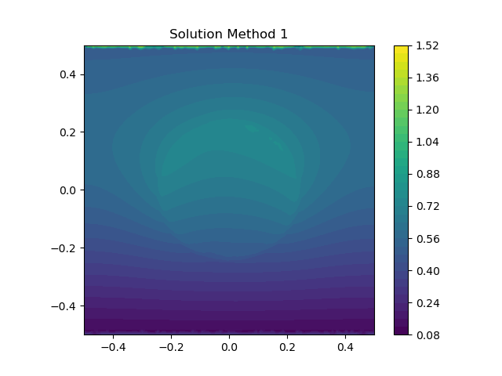
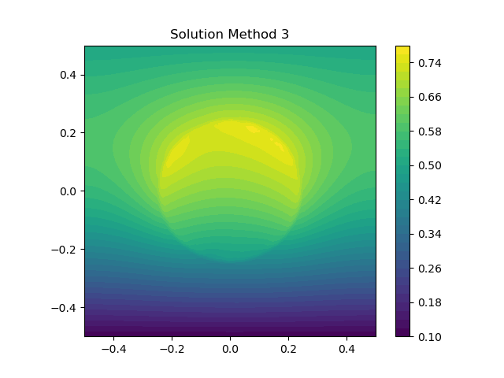

# About

This repository contains a minimum working example to demonstrate that FEniCS
obtains an erroneous solution along external boundaries with nonzero Dirichlet
BCs when using `assemble_system` in conjunction with a source term on an
internal boundary.

# Summary

This error is demonstrated through a simple electrostatics problem consisting
of a surface-charged circle embedded in a square domain with fixed non-
homogeneous potentials on the top and bottom edges. Three solution methods are
used:

1. Assembly using `assemble_system` and solution of the resulting linear
   system:
   
   ```
   A, b = assemble_system(a, L, bcs)
   solve(A, sol1.vector(), b)
   ```
2. Direct solution of the linear variational problem `a == L` using
   
   ```
   solve(a == L, sol2, bcs)
   ```
3. Assembly using `assemble`, subsequent application of Dirichlet BCs,
   solution of the linear system:
   
   ```
   A = assemble(a)
   b = assemble(L)
   for bc in bcs:
       bc.apply(A)
       bc.apply(b)
   solve(A, sol3.vector(), b)
   ```

## Incorrect solution

Solving via method 1 gives a solution which is correct everywhere except the
top and bottom boundaries:



## Correct solution

Solving via method 2 gives the correct solution, including on the top and
bottom boundaries:

### Method 2


### Method 3



